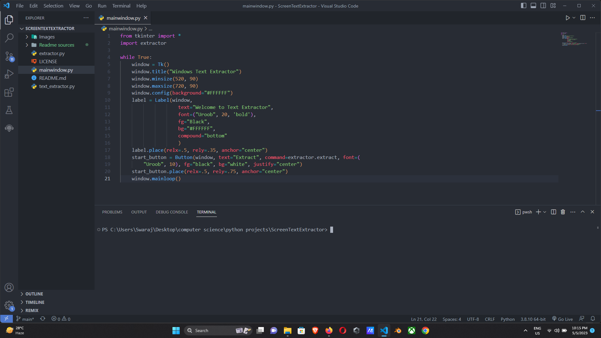
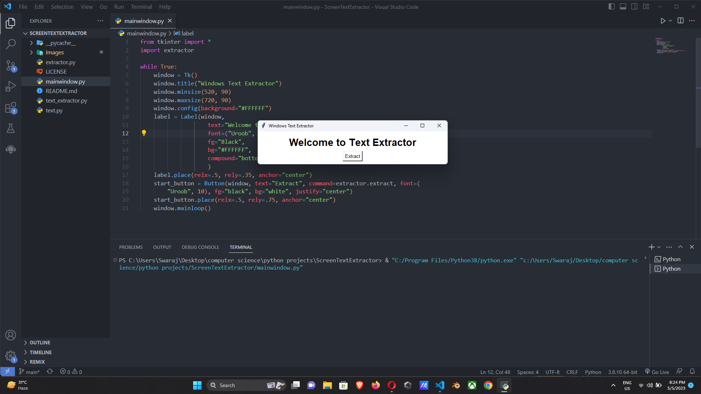
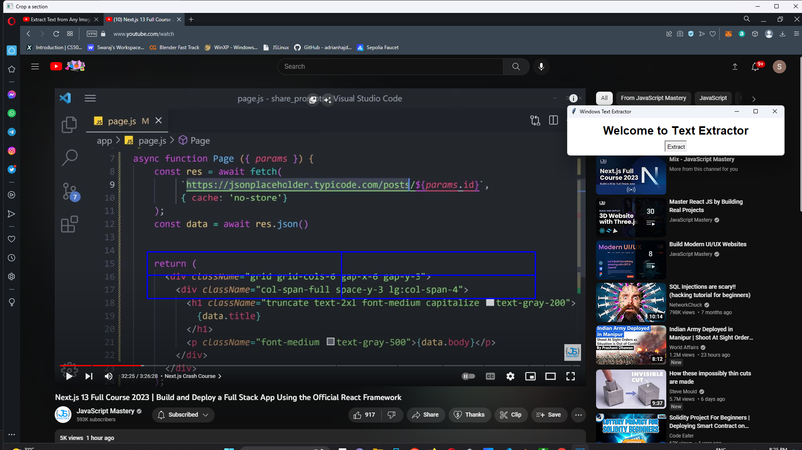
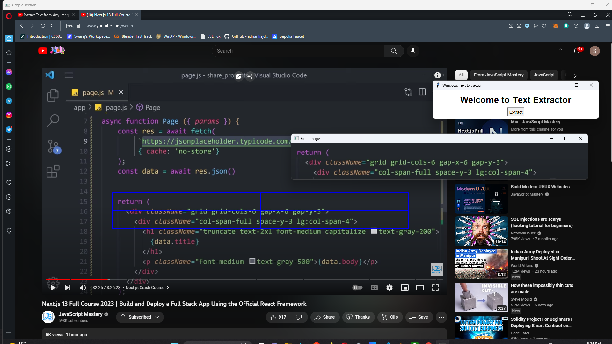
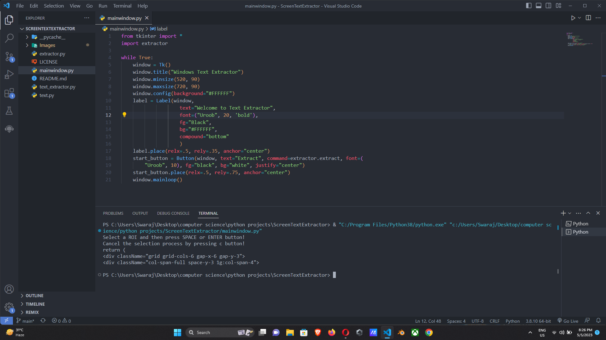

# ScreenTextExtractor
A Text extractor using OpenCV which extract text from the working screen.

## Usage
- Open the project folder on Visual Studio Code.

- Run the mainwindow.py file.

- Open the screen where the desired text is present and click on Extract.

- Crop the section you want to extract from and Press Enter to approve or c key to cancel the process or click anywhere on the window to recrop.

- Press Enter to finalize or click on close button to exit.
- You have your text generated on the terminal

